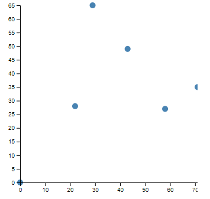
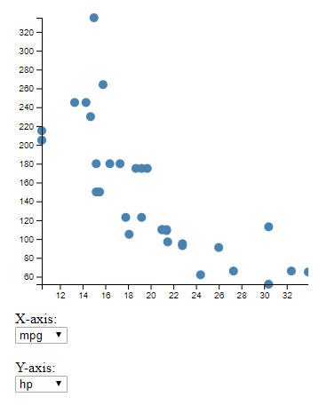

# vFlow: Tutorial

This tutorial describes how a quite simple example can be built with the usage of vFlow library. The goal is to create a scatter plot with dynamic data. X-axis and Y-axis of scatter plot should update dynamically as well.   

## Simple example

To use the vFlow library, we need to include the following in our `<head>`:

```html
<script src="../../lib/rxjs/rxjs.umd.min.js"></script>
<script src="../../lib/d3/d3.v5.min.js"></script>
<script src="../../build/vflow.js"></script>
```

The first two are the RxJS and D3 libraries, which are used for reactivity and visualization. The third is the vFlow library.

To render the plot, we first need a container `div`.

```html
<body>
    <div id="plotDiv"></div>
</body>
```

Let's use some example data for our plot.

```js
let data = [
    {
        "x": 0,
        "y": 0
    },
    {
        "x": 29,
        "y": 65
    },
    {
        "x": 43,
        "y": 49
    },
    {
        "x": 58,
        "y": 27
    },
    {
        "x": 71,
        "y": 35
    },
    {
        "x": 22,
        "y": 28
    }
];
```

To plot these data using a scatter plot, we can use the following code.

```js
// Create a component.
let plot = new vf.D3Scatterplot("plotDiv");

// Specify the plot's inputs.
plot
    .input("data", data)
    .input("xAttr", "x")
    .input("yAttr", "y");

// The above code can be written together.
let plot = new vf.D3Scatterplot("plotDiv")
    .input("data", data)
    .input("xAttr", "x")
    .input("yAttr", "y");
```

The above code produces the following plot.



You can find the complete example [here](tutorial_example_simple.html).

## Main example

In this example we have to load dynamic data from this CSV [file](sample_data/mtcars.csv).

First, we need to include the following in our `<head>`:

```html
<script src="../../lib/rxjs/rxjs.umd.min.js"></script>
<script src="../../lib/d3/d3.v5.min.js"></script>
<script src="../../build/vflow.js"></script>
```

To load the data from the CSV file, we need a DSVLoader component. 

```js
let dataLoader = new vf.DSVLoader()
    .input("filename", "sample_data/mtcars.csv")
    .input("delim", ";")
    .log("out");
```    

Except for the file name, we have to define the delim input (delimiter) so that the CSV file can be successfully read.

We can use log("out") which prints the output "out" in the console.

An HTMLSelect component will display all CSV fields, so that the user selects the variable for the X-axis of the scatter plot. An HTMLSelect component for the Y-axis is necessary as well.

So, we need a Transformation component which will have as input the dataLoader output and it will have as output the columns of the CSV file.

```js
let attributes = new vf.Transformation(
    function (d) { 
        if (d) {
            return Object.keys(d[0]); 
        }  
    } 
)
.input("input", dataLoader.outputs["out"])
.log("out");
 ```

Now we can create the HTMLSelect component for the selection of the x-Axis parameter.

```html
<div id="selectDiv1"></div>
```

```js
let selectX = new vf.HTMLSelect("selectDiv1")
    .input("data", attributes.outputs["out"])
    .log("selected");
```    

As it has been mentioned, we need an HTMLSelect component for the Y-axis as well.    

```html
<div id="selectDiv2"></div>
```

```js
let selectY = new vf.HTMLSelect("selectDiv2")
    .input("data", attributes.outputs["out"])
    .log("selected");
```    

Finally, we create the D3Scatterplot component. 

```html
<div id="plotDiv"></div>
```

```js
let plot = new vf.D3Scatterplot("plotDiv")
    .input("data", dataLoader.outputs["out"], function (d) {if (d) {return d;} } )
    .input("xAttr", selectX.outputs["selected"], function (d) {if (d) {return d;} } )
    .input("yAttr", selectY.outputs["selected"], function (d) {if (d) {return d;} } );
```    

The data input comes from the dataLoader output. The third parameter function (d) {if (d) {return d;} } checks if there are data. We could have used any type of transformation.
As described above, xAttr and yAttr inputs come from the corresponding HTMLSelect component outputs.    

The above code produces the following visualization.



Note that you need to select numeric attributes from the lists, in order for the scatterplot to appear properly. E.g. you can choose the `mpg`, `cyl`, `disp`, `hp`, `drat`, `wt`, etc. columns.

You can find the complete example [here](tutorial_example.html).

